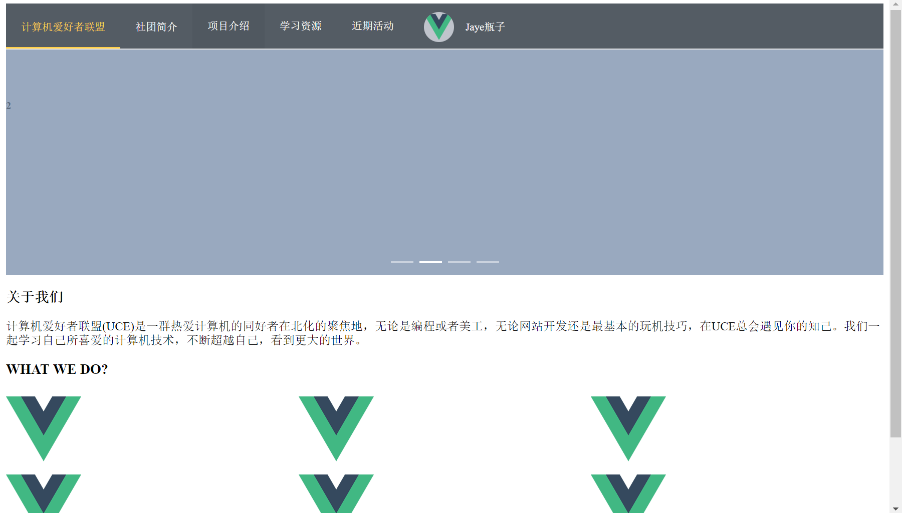
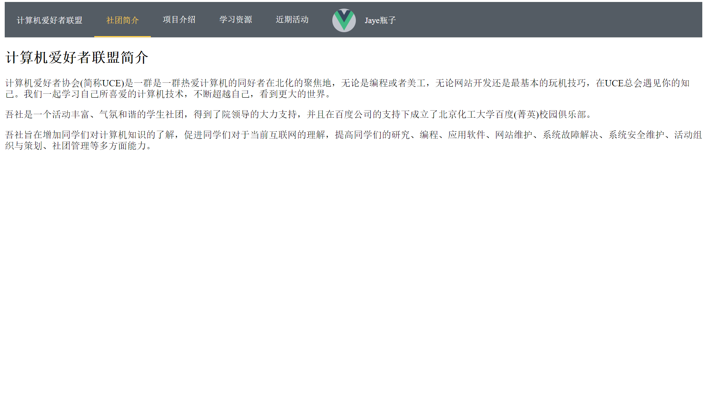

# WebSite

----------

> 项目名称：`WebSite`

> 开发者：`SKS`

### 1. 项目目的和介绍
---
建立社团网站，拓宽社团信息交流渠道。

### 2. 功能设计
---

### 3. 核心思路
---
##### 1. 开发语言
使用`vue`, `vue-router`, `vuex`, `element-ui` 来搭建前端

##### 2. 用户使用逻辑

##### 3. 数据结构

##### 4. 重要数据

##### 5. 函数一览

##### 6. 核心函数

### 4. 效果展示
---
目前的施工进度

### index

### about

### 5. 总结
---

##### 1. 引语：

##### 2. 收获：

##### 3. 后续：

